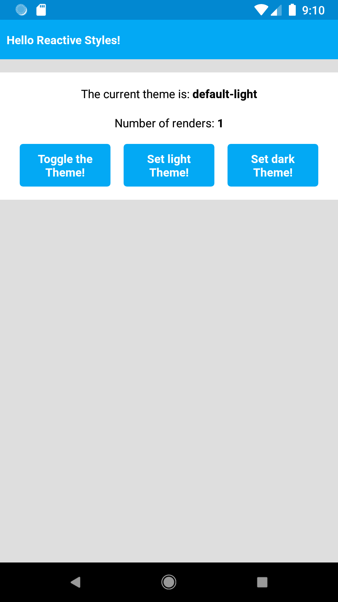
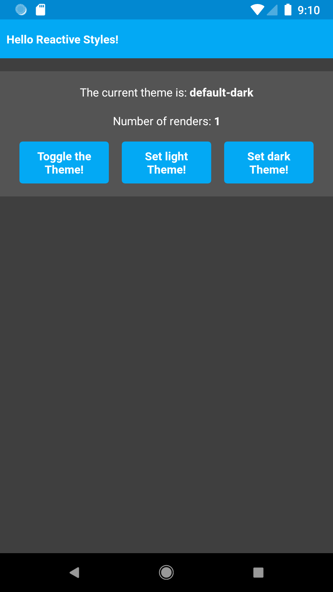
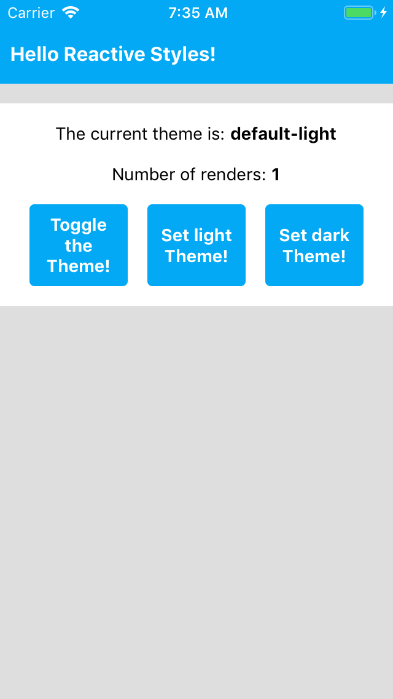
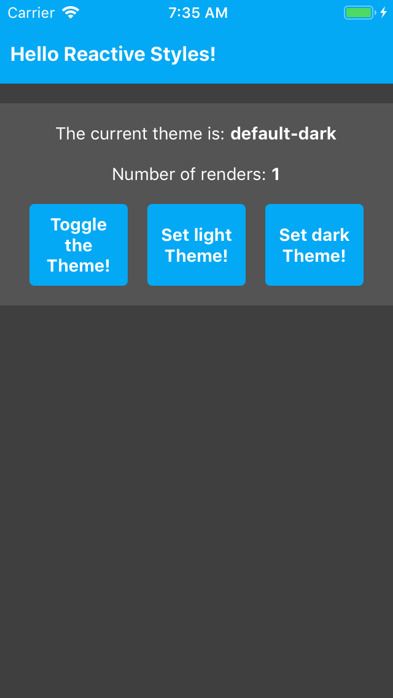

# Reactive styles in React Native example

This repository contains example code for my article published on Medium.

| Light Theme | Dark Theme |
| :------------- | :----------: | :----------: | :----------: |
|  |  |
|  |  |

## Overview

The example project contains the following:
- `Theme.interface` for defining the Theme
- `DefaultLight.theme` and `DefaultDark.theme` as Theme variations
- `Theme.context` for poviding and managing the Theme
- `ThemeAwareObject.hook` for reusing the creation logic of reactive Style objects
- `Card.component` for consuming and updating the Theme
- `RenderCounter.component` for counting the number of renders
- Other components (`ScreeenView.component`, `Toolbar.component`) for consuming the Theme

## How to run

Install dependencies:
```
npm install
```

Run Android:
```
npm run android
```

Run iOS:
```
npm run ios
```